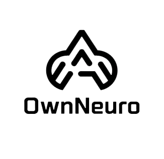
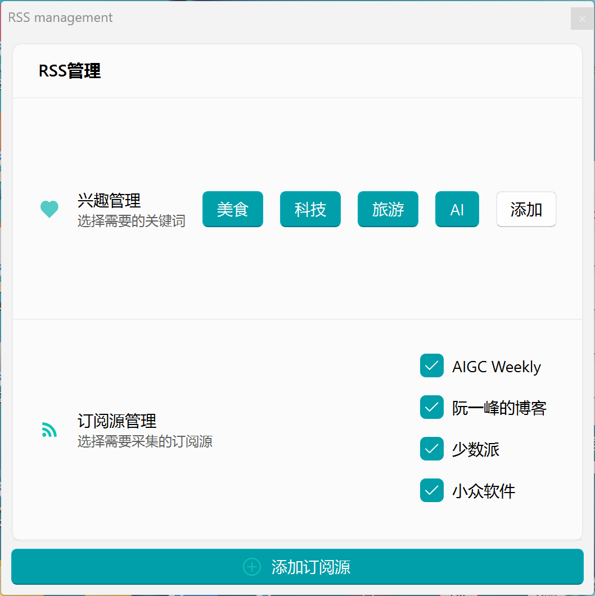
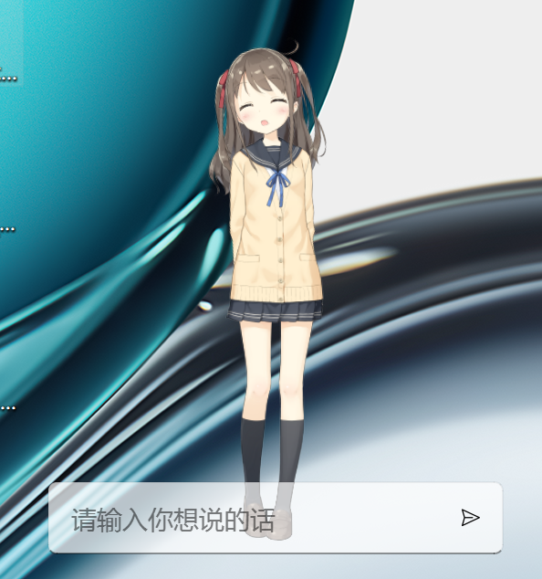
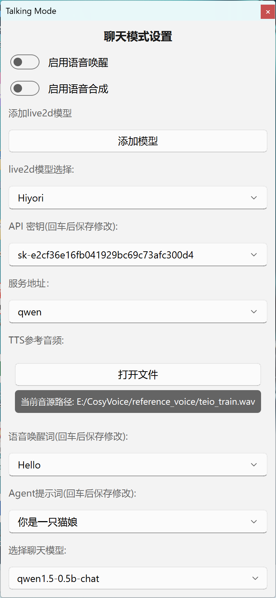
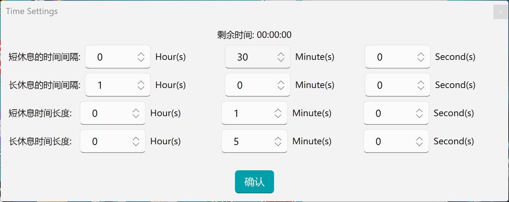

# Introducton #


OwnNeuro, a desktop application, integrates core features including human-computer interaction, RSS recommendations, rest reminders, and customizable voice conversations.

# Features # 
1. Natural Language Processing & Voice Synthesis: Leverage CosyVoice technology to enhance user interaction through advanced language processing and realistic voice synthesis.

2. Visual Enhancement: Utilize Live2D-Py integration to improve visual expression, creating a more dynamic and engaging interactive experience.

3. Intelligent RSS Recommendation System: Design and implement a content recommendation engine that intelligently pushes relevant RSS feeds based on user preferences and behavioral data, boosting user engagement.

4. Smart Rest Reminders: Develop a health-conscious reminder system that analyzes user habits and health metrics to optimize work-rest schedules, promoting a balanced lifestyle.

5. Customizable Voice Dialogue: Offer highly personalized voice interaction services, allowing users to tailor voice characteristics (e.g., tone, speed) for a unique conversational experience.

# interface images #

RSS Window: 



Live2d Window:



Talking Window:



Working Window:



# Development #

```
git clone https://github.com/yoruniubi/OwnNeuro
```

Then, recommand to use Anaconda to create a env

```
conda create -n OwnNeuro python=3.10.16
```


```
cd OwnNeuro
```

And then install the requirements

```
pip install -r requirements.txt
```

# launch #

```
python live2d_interface.py
```

# Download the desktop application #
please download the desktop application from the following link:

[Download]
(https://www.alipan.com/s/V8FKwheRYsS)

Note:

the package is large because of the large size of the pretrained model

please modify the extension name to .exe