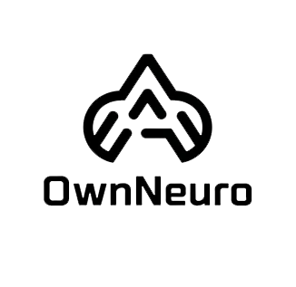
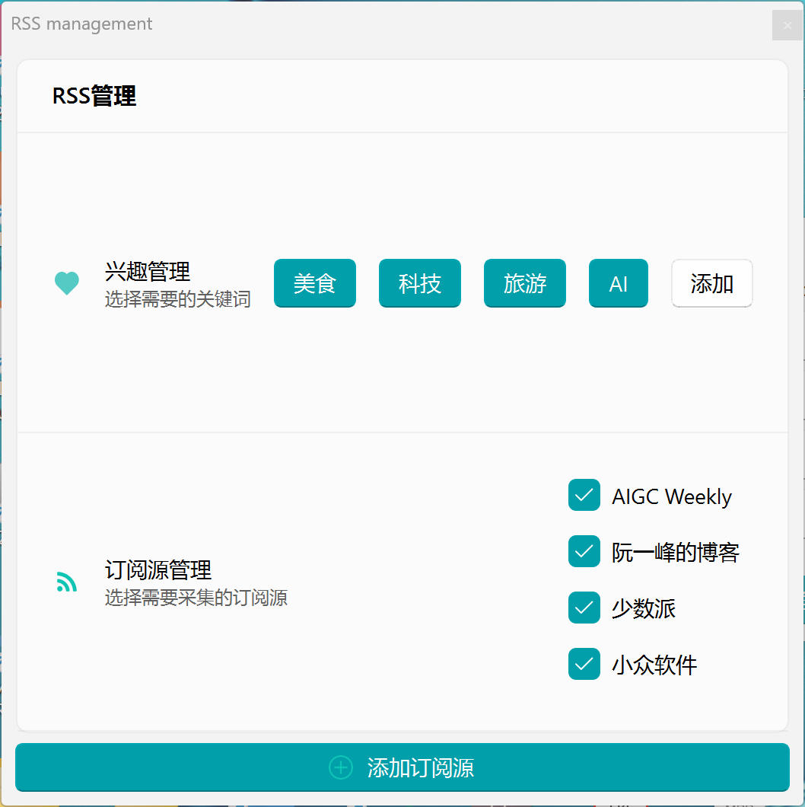
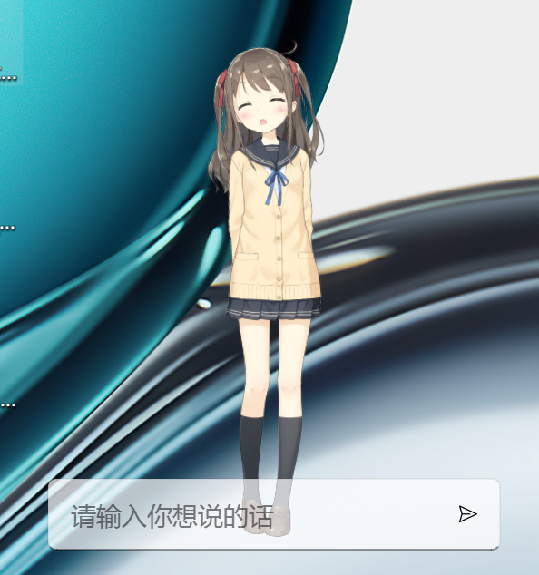
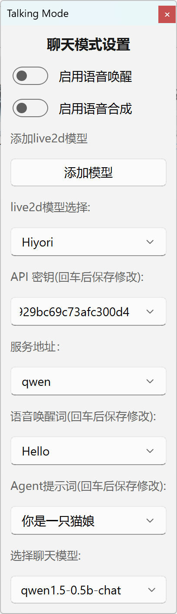
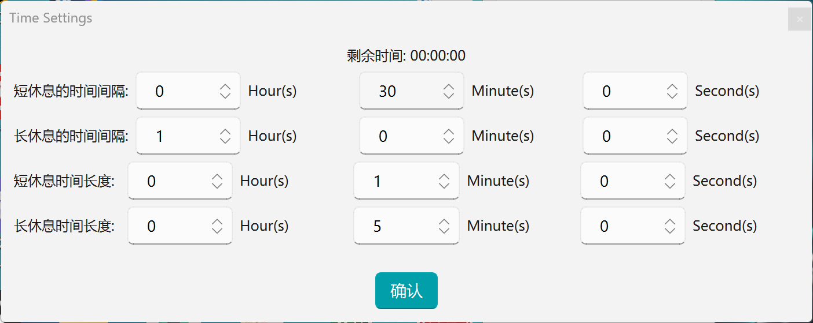

## 选择一个语言:  ## 
[English](Readme.md) | [中文](Readme_zh.md)
# 介绍 #


OwnNeuro 是一款桌面应用程序，集成了人机交互、RSS 推荐、休息提醒和可定制语音对话等核心功能。

# 功能特性 #
1. 自然语言处理与语音合成：利用 Spark-TTS 技术，通过先进的语言处理和逼真的语音合成增强用户交互。

2. 视觉增强：利用 Live2D-Py 集成，改善视觉表现，创造更具动态和吸引力的互动体验。

3. 智能 RSS 推荐系统：设计并实现一个内容推荐引擎，根据用户偏好和行为数据智能推送相关 RSS 订阅，提高用户参与度。

4. 智能休息提醒：开发一个健康提醒系统，分析用户习惯和健康指标，优化工作与休息时间表，促进平衡的生活方式。

5. 可定制语音对话：提供高度个性化的语音交互服务，允许用户定制语音特征（例如音调、语速），以获得独特的对话体验。

# 界面图片 #

RSS 窗口:



Live2d 窗口:



对话窗口:



工作窗口:



TTS 设置:


# 开发 #

```
git clone https://github.com/yoruniubi/OwnNeuro
```

然后，建议使用 Anaconda 创建一个环境

```
conda create -n OwnNeuro python=3.12.9
```

```
cd OwnNeuro
```

然后安装依赖

```
pip install -r requirements.txt
```

# 启动 #

```
python live2d_interface.py
```

# 下载桌面应用程序 #
请从以下链接下载桌面应用程序：

[下载]
(总文件大小为3.5G，包含预训练模型)

(https://www.alipan.com/s/QcV15UBpbb4)

或者从Github Release下载
注意:

由于预训练模型体积较大，软件包较大

请将扩展名修改为 .exe
